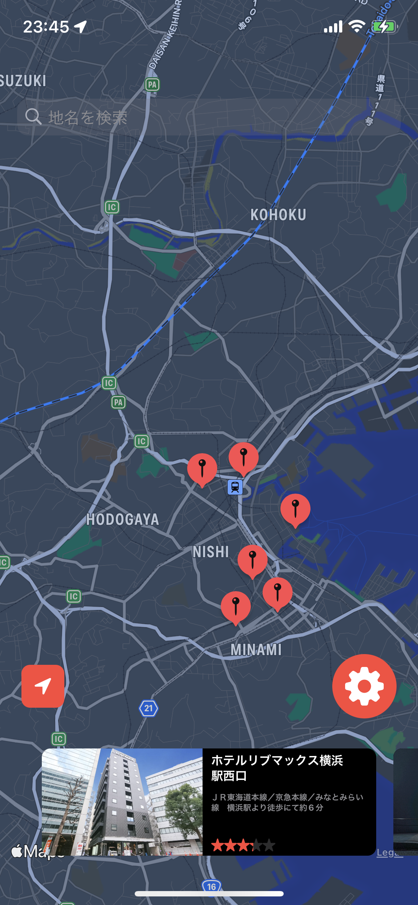
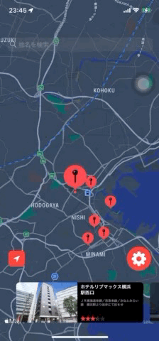
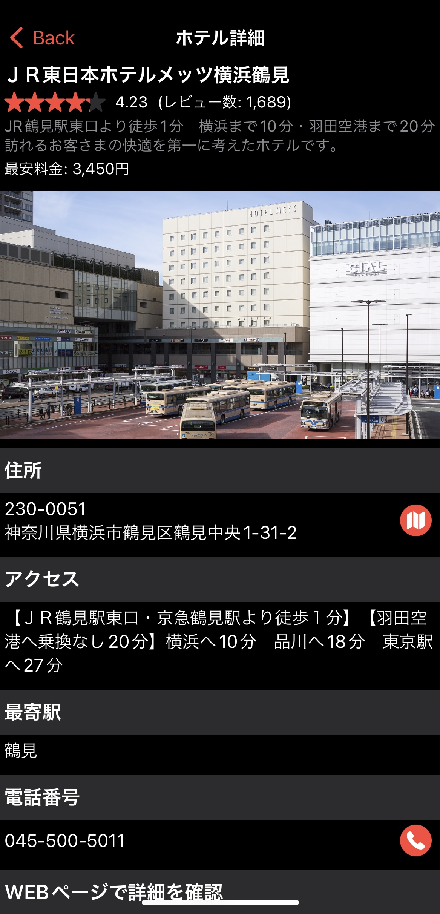
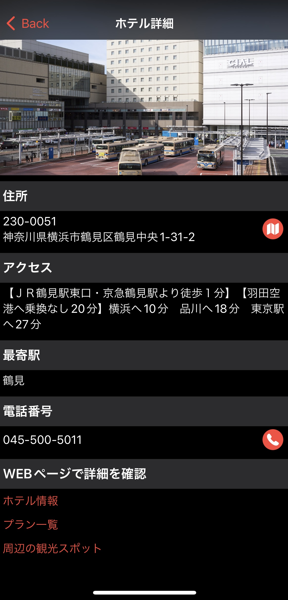
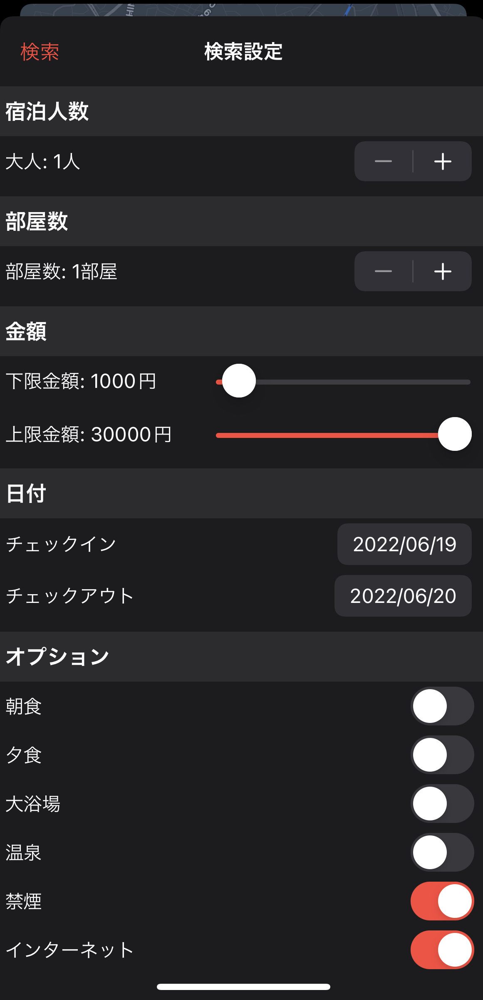

## What's WorkHotel?
- This sample app `WorkHotel` is to search vacant-room hotels while you are in workcation(work + vacation).
- This iOS app is mainly implemented using `SwiftUI`.
- This app' s source code is divided into multi packages of local `Swift Package`.
    - [WorkHotelCore](./WorkHotelCore), [WorkHotelMap](./WorkHotelMap), [WorkHotelDetail](./WorkHotelDetail), [WorkHotelSearchOption](./WorkHotelSearchOption) are implemented.

## Pages
- This app contains three page.
    -  Map page
        - Display vacant hotels information by Map pins and carousel views.
            - If you zoom or drag map, hotels will be searched again and pins and carousel views will be displayed.
            - Carousel view display hotel basic information, hotel image, hotel name, hotel access, average review.
            - If you scroll carousel view, applicable pin will be centered.
            - Pin positions are sorted by distance from center to pin position.
            - By entering place keyword in search bar, the place will be displayed.
            - If getting user current location is authorized, this app can display user current location and button to show current location.
        - Push Detail page by tapping carousel view.
        - Present search option page by tapping setting button.

    - Detail page
        - This page displays hotel basic information.
            - By tapping `ホテル情報` or `プラン一覧`, the hotel information or plan information in detail will be displayed in external browser.
            - By tapping `周辺の観光スポット`, sightseeingSpot information around the hotel will be searched in the external browser.
        - If you want to watch the hotel location in map, tap map button, then Apple map app will be opened and the pin of hotel location will be added.
        - If you want to call to the hotel, tap phone button.

-  Search option page
    - This page configure search option.
        - This page can configure many options, so you can apply a detailed filters.
    - This page contains validation logic about option, e.g. checking check-in date should be smaller than check-out date and so on.
    - After dismissing this page, hotels will be searched again.

## Other features
- This app is mainly implemented by SwiftUI, so you can implement quickly by using `Xcode Preview`.
- This app contains unit test to check if decode json is enabled and validation of search option is enabled([WorkHotelCoreTests.swift](WorkHotelCore/Tests/WorkHotelCoreTests/WorkHotelCoreTests.swift))
- This app is using dependency injection, so this app's API calling can be replace to mock code.
    - If you replace `WorkHotelRepository` to `WorkHotelMock` in [WorkHotelMapView.swift](WorkHotelMap/Sources/WorkHotelMap/WorkHotelMapView.swift), you can check app without calling api.

## Things to be implemented
- Detail error handling.
- Image cache.
- iPad / landscape implement
- localization support

## API Reference
- This app uses [Rakuten Travel Vacancy Search API](https://webservice.rakuten.co.jp/documentation/vacant-hotel-search).
    - If you want to try this api, you must issue ApplicationID.
        - If you have RakutenID and want to run this sample app, you need to issue ApplicationID([Reference](https://webservice.faq.rakuten.net/hc/ja/articles/900001970586))
    - In this repository, ApplicationID is defined in [NetworkCredentials.swift](WorkHotelCore/Sources/WorkHotelCore/Network/NetworkCredentials.swift), but this file is written in .gitignore. So if you issued new ApplicationID, please rewrite ApplicatinId written in [VacantHotelSearchParameter.swift](WorkHotelCore/Sources/WorkHotelCore/Network/VacantHotelSearchParameter.swift).

## Libraries
- This app uses libraries below.
    1. [Alamofire](https://github.com/Alamofire/Alamofire)
        - This library is used in network process.
    2. [SwiftExtensions](https://github.com/u5-03/SwiftExtensions)
        - This is the library I created. This contains a variety of extension code I usually use in iOS development.

## Known bug
- Scroll center position after drag animation.
    - It is because the center position is captured after not finishing drag animation but drag end(finger touch up).